# Tugas Praktikum Sistem Cerdas Image-Classification

## Latar Belakang
Image-Classification adalah suatu teknik pengolahan citra atau gambar yang bertujuan untuk mengenali kelas atau kategori suatu gambar berdasarkan fitur-fitur yang terdapat pada gambar tersebut. Teknik ini dapat diterapkan pada berbagai bidang seperti deteksi objek, pengenalan wajah, pengenalan karakter tulisan tangan (handwriting recognition), dan lain-lain. Image-Classification memanfaatkan metode-metode Machine Learning atau Deep Learning, di mana model dilatih dengan data-data gambar yang telah diberi label atau kategori, sehingga model dapat mempelajari pola atau fitur-fitur yang muncul pada data tersebut dan kemudian diterapkan pada data gambar baru untuk memprediksi kategori atau kelasnya.

### Nama Mahasiswa
1. Rafitajudin (21220002)

<br/>
<br/>

## Running
manually by running:

```bash
> Python "namafile".py
```

ikuti kode dibawah kemudian nanti akan ada file "model1_cifar_10epoch.h5"
<p align="center">
    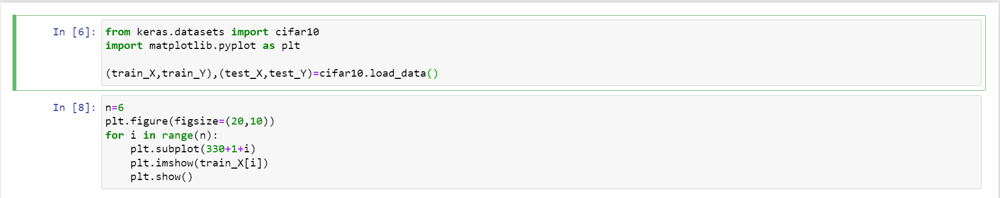
    <br>
 </p>
 <br/>
<p align="center">
    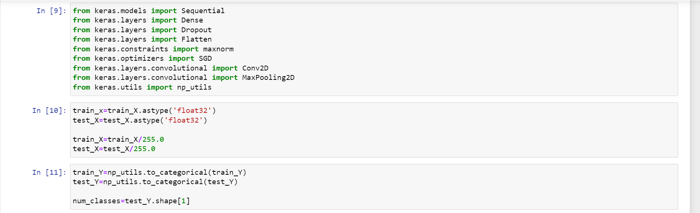
    <br>
 </p>
 <br/>
<p align="center">
    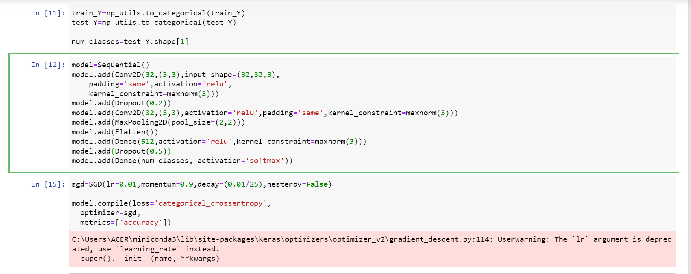
    <br>
 </p>
 <br/>
<p align="center">
    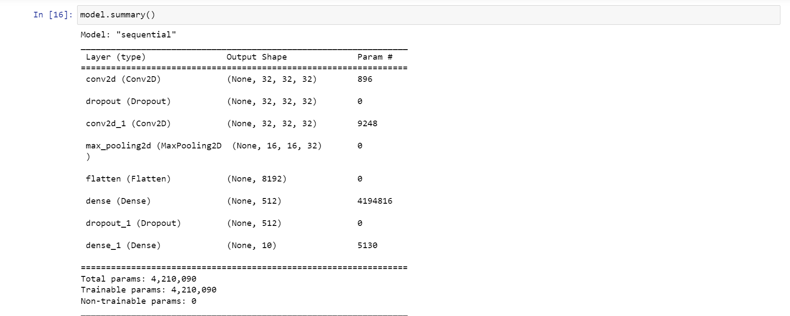
    <br>
 </p>
<br/>
<p align="center">
    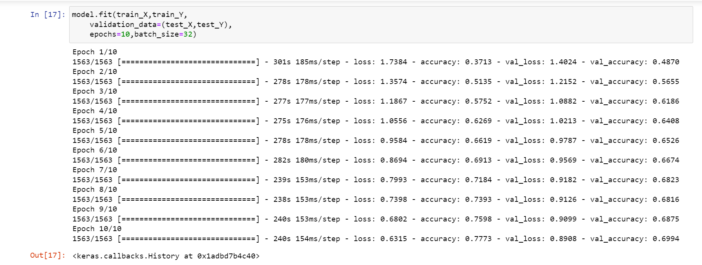
    <br>
 </p>
<br/>
 <p align="center">
    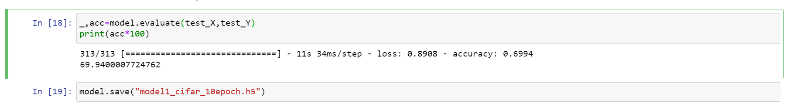
    <br>
 </p>

Bikin file dengan nama apk.py dengan kode
 <p align="center">
    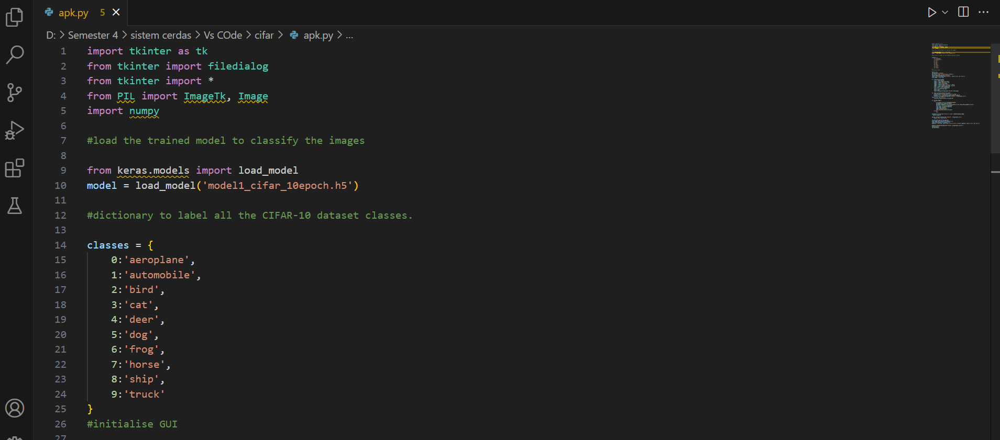
    <br>
 </p>
  <p align="center">
    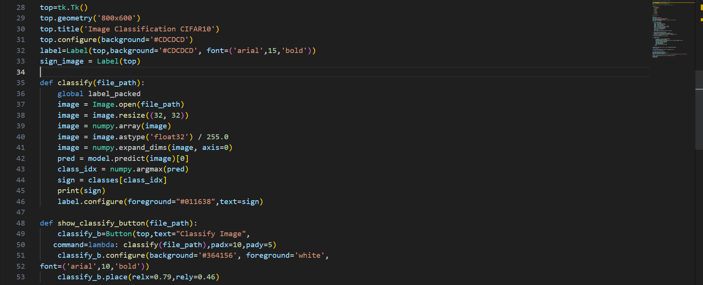
    <br>
 </p>
  <p align="center">
    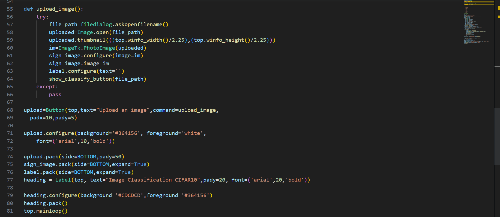
    <br>
 </p>

lalu simpan kedua file dalam folder yang sama
 </p>
  <p align="center">
    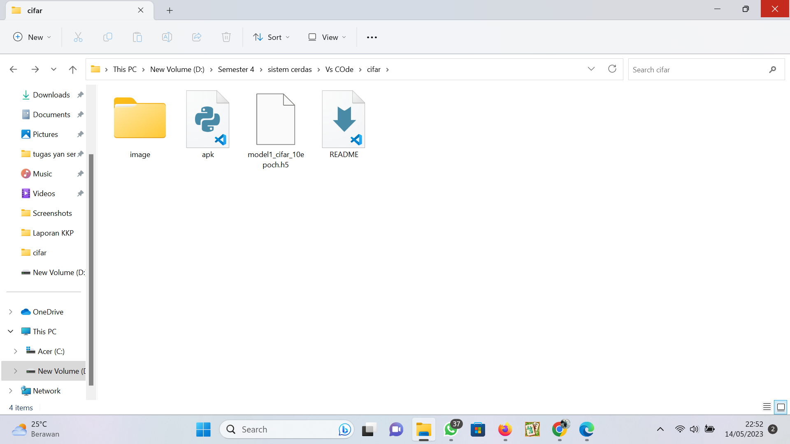
    <br>
 </p>

kemudian run dengan perintah "python apk.py"
 </p>
  <p align="center">
    
    <br>
 </p>

upload image yang akan di klasifikasi
 </p>
  <p align="center">
    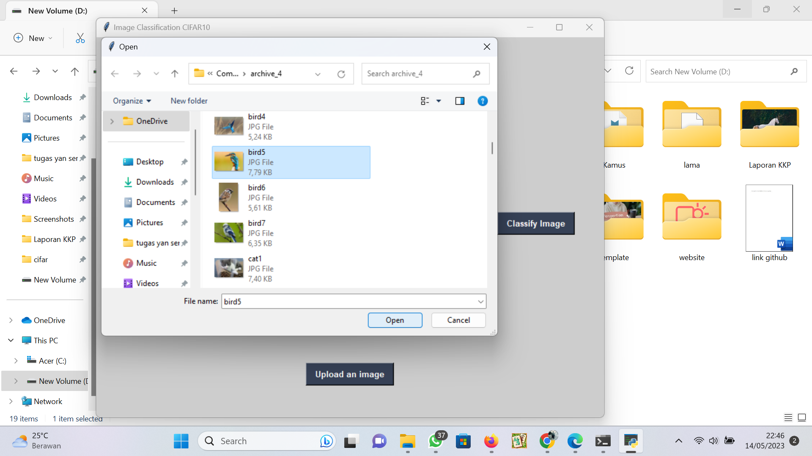
    <br>
 </p>

klik klasifikasi
 </p>
  <p align="center">
    
    <br>
 </p>
 <br/>
  </p>
  <p align="center">
    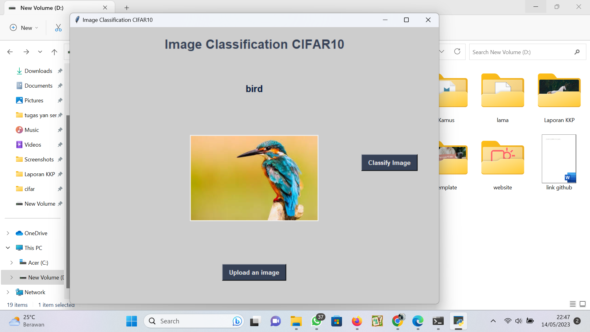
    <br>
 </p>